<h1 align="center">Loan Approval Prediction</h1>

## Loan Approval Prediction

  

## Table of Content

- [Problem statement](#problem-statement)
- [Introduction](#introduction)
- [Motivation](#motivation)
- [Project Explanation](#project-explanation)
    - [Data Collection](#data-collection)
    - [Hypothesis Generation](#hypothesis-generation)
    - [About the Dataset](#about-the-dataset)
    - [Data Analysis](#data-analysis)
    - [Feature Creation](#feature-creation)
    - [Model Performance](#model-performance)
    - [Test Data Prediction](#test-data-prediction)
 - [Conclusion](#conclusion)
   
## problem statement

Dream Housing Finance company deals in all home loans. They have a presence across all urban, semi-urban and rural areas. Customers first apply for a home loan after that company validates the customer’s eligibility for a loan. The company wants to automate the loan eligibility process (real-time) based on customer detail provided while filling out the online application form. These details are Gender, Marital Status, Education, Number of Dependents, Income, Loan Amount, Credit History, and others. To automate this process, they have given a problem to identify the customer segments, that are eligible for loan amounts so that they can specifically target these customers.
## Introduction

-	In this Loan Status Prediction dataset, we have the data of applicants those who previously applied for the loan, which is Property Loan.
-	The bank will decide whether to give a loan for the applicant based on some factors such as Applicant Income, Loan Amount, previous Credit History, Co-applicant Income, etc..,
-	Our goal is to build a Machine Learning Model to predict the loan to be approved or to be rejected for an applicant.
-	In this project, we are going to classify an individual whether he/she can get the loan amount based on his/her Income, Education, Working Experience, Loan which is taken previously, and many more factors.

  

## Motivation

-	This project was started as a motivation for learning Machine Learning Algorithms and to learn the different data preprocessing techniques such as Exploratory Data Analysis, Feature Engineering, Feature Selection, Feature Scaling and finally to build a machine learning model.
- In this project, I have implemented various data pre-processing tecniques such as imputing null values, encoding categorical columns and handled the imbalanced data.

##  Project Explanation

### Data collection

- The dataset is collected from [Kaggle](https://www.kaggle.com/altruistdelhite04/loan-prediction-problem-dataset).
- The dataset which we get from kaggle consists of two CSV(Comma Separated Values) files.
  - One is Train Data (`train_u6lujuX_CVtuZ9i.csv`)
  - Another is Test Data (`test_Y3wMUE5_7gLdaTN.csv`)

### Hypothesis Generation

Below are some of the factors which I think can affect the Loan Approval ,dependent variable for this loan prediction problem:

- **Salary:** Applicants with high income should have more chances of getting approval.
- **Previous history:** Applicants who have paid their historical debts have more chances of getting approval.
- **Loan amount:** Less the amount higher the chances of getting approval.
- **Loan term:** Less the time period has higher chances of approval.
- **EMI:** Lesser the amount to be paid monthly, the higher the chances of getting approval.

### About the dataset
- The Training data consists of 614 applicant samples and 13 features.
- We have 12 independent variables and 1 dependent variable, i.e. Loan_Status.
- The 12 independent features are Loan_ID, Gender, Married, Dependents, Education, Self_Employed, ApplicanIncome, CoapplicantIncome, LoanAmount, Loan_Amount_Term, Credit_History and Property Area.
- We have similar features in the test dataset as the training dataset except for the Loan_Status. We will predict the Loan_Status using the model built using the train data. Given below is the description for each variable.
- The dataset which we are working on is an Imbalanced dataset, we will try to tackle this problem also.

### Data Analysis
Let's explore these features

**Loan_ID**
- The Loan_ID is generally is used to identify an applicant uniquely but in any way, it doesn’t decide the loan status. So we can ignore the Loan_ID column for the prediction.

**Gender**
- Gender is a nominal kind of qualitative data, because there is no numerical relation between different genders.
- For 13 applicants, Gender is not mentioned in the data.
- The Unique values are `Male` and `Female`.
- There are 489 Male and 112 Female applicants
- 81.4% of Applicants are male and 16% are female
- It can be inferred that the proportion of male and female applicants is more or less the same for both approved and unapproved loans.

  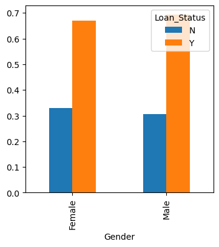
  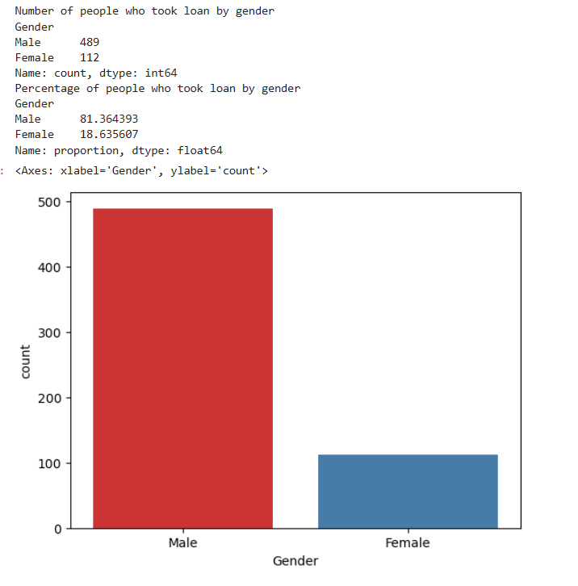

**Married**
- Since there are only 2 kind of values are possible to be present in this feature which is married or not married. This is a binary kind of qualitative data.
- For 3 applicants, Married is not mentioned in the data.
- The two unique values present in the feature is `Yes` and `No`.
- 65% of the applicants applying for loan are married
- The proportion of married applicants is higher for the approved loans.

  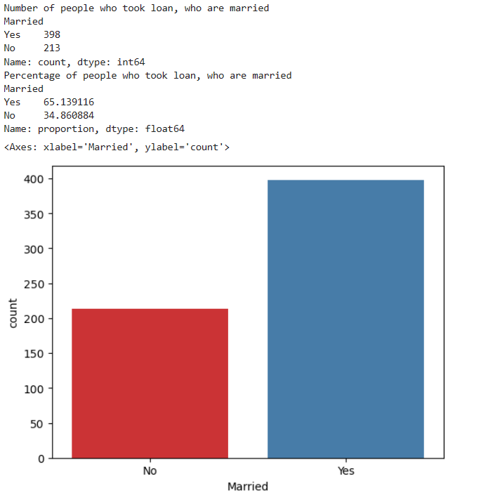
  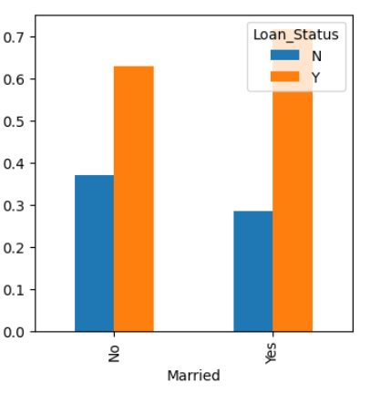

**Dependents**
- The Dependents feature is a discrete kind of quantitative data.
- From my thought, dependents feature refer to how many people are relying on a particular person income.
- For 15 applicants, Dependents is not mentioned in the data.
- There are 4 unique values present in this feature. They are 0, 1, 2, and 3+.
- Most of the applicants don’t have dependents.
- The distribution of applicants with 1 or 3+ dependents is similar across both the categories of Loan_Status, Approved or Declined.

  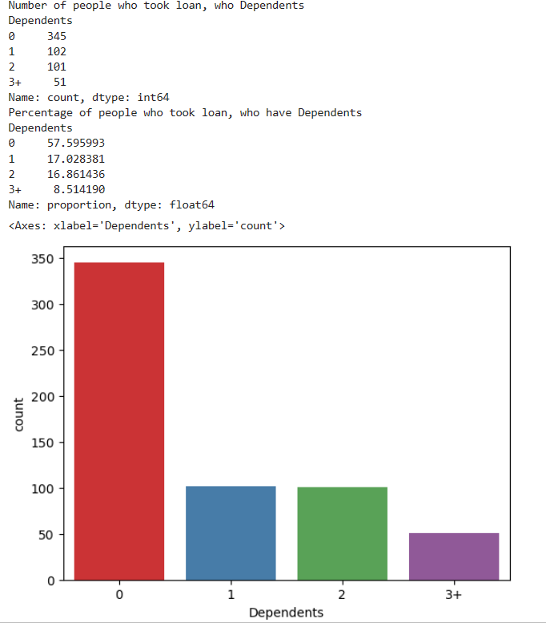
  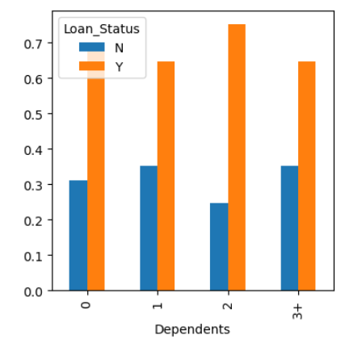

**Education**
- The Education column is a binary kind of qualitative data. Because there are only two values possible in this feature. They are `Graduated` and `Not Graduated`.
- All the applicants have given their Education Details
- About 80% of the applicants are graduates.
- It seems people who are graduated are more likely to be approved for loan.

  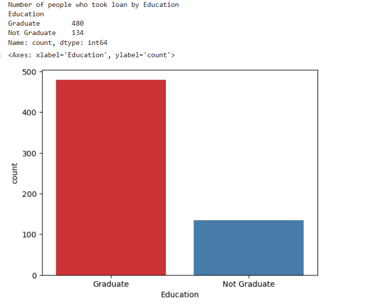
  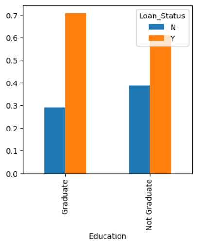

**Self_Employed**
- The Self_Employed column is a binary kind of qualitative data. Because there are only two values possible in this feature. They are Self_Employed and Not Self_Employed.
- For 32 applicants, Self_Employed status is not mentioned in the data
- The two binary values are `Yes` and `No`.
- Nearly 86% percentage of the applicant are not self employed.
- From the data, It is significant that Self employement doesnot play a huge role in loan approval.

  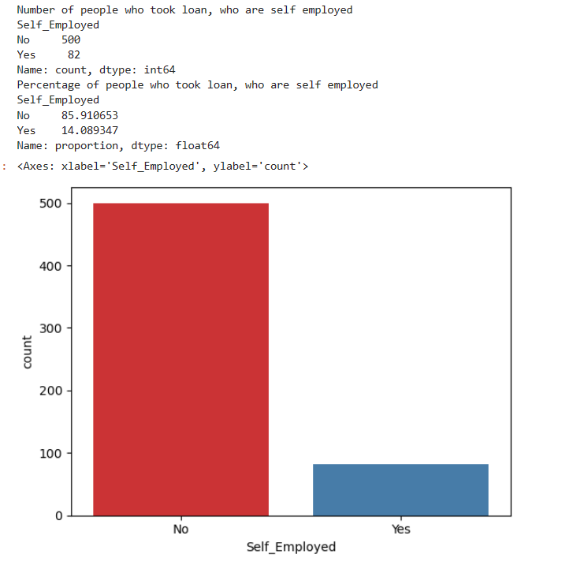
  

**Loan_Status**
- The Loan_Status column is our dependent variable, and is a binary kind of qualitative data. Because there are only two value possible. They are Approved and Declined.
- The two binary values are `Yes` and `No`.
- 422(around 69%) people, Out of 614 got Loan aproval. Making this dataset an Imbalanced Dataset.

  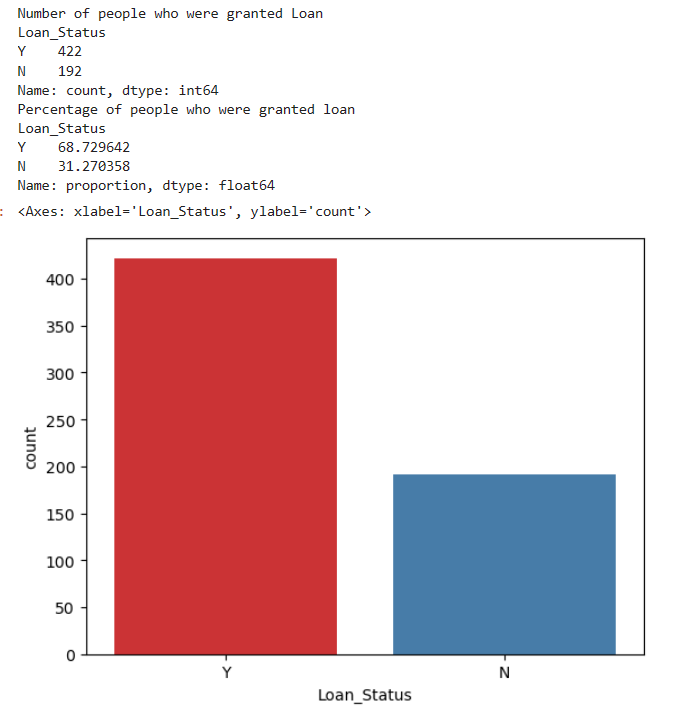

**Applicant_Income**
- The Applicant Income column is a continuous kind of quantitative data.
- All the applicants provided their Applicant Income.
- From the distplot, we can see most of the Applicants income less than Rs.10,000 and some considerable amount of applicants having income between Rs.10,000 and Rs.20,000.
- It can be inferred that most of the data in the distribution of applicant income are towards the left which means it is not normally distributed. 
- we can also see there are lot of outliers in this data. we will treat them accordingly.
- It can be inferred that Applicant’s income does not affect the chances of loan approval which contradicts our hypothesis in which we assumed that if the applicant’s income is high the chances of loan approval will also be high.

  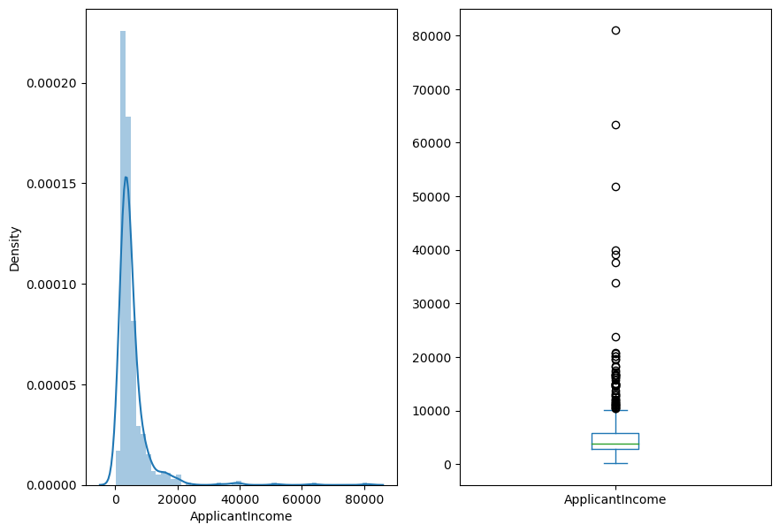
  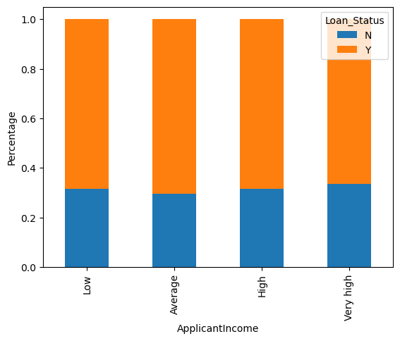

**Co_Applicant Income**
- The Co-applicant Income column is a continuous kind of quantitative data.
- All the applicantincome provided their Co_Applicant Income.
- It doesn’t have much effect on our loan status.

  

**Credit_History**
- It is a binary kind of qualitative data.
- For 50 applicants, the Credit_History are not mentioned in the data.
- It consists of binary values.
    - For applicants having Credit_History - `1`
    - For applicants aving Credit_History - `0`
- If the applicant is having Credit_History, then there is a difficulty on classifying for loan approval.
- But if the applicant is not having Credit_History, then there is a high probability chance of rejection.
- 84.2% of applicants have Credit_History, meaning they have repaid their debts.
- It seems people with a credit history of 1 are more likely to get their loans approved. Approving our hypothesis.

  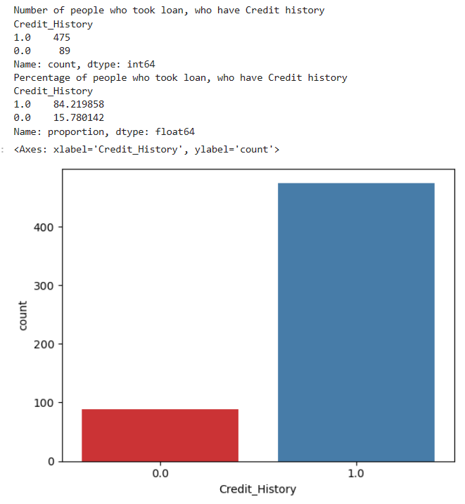
  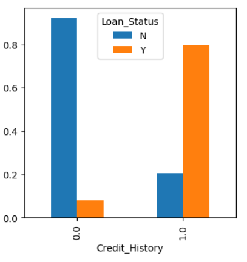

**Loan_Amount**
- The Loan_Amount column is a continuous kind of qualitative data.
- For 22 applicants, the LoanAmount are not mentioned in the data.
- Most of the data in the distribution of loan amount are towards left which mean it is not normally distributed.
- we see lot of of outliers and will treat them accordingly.
- It can be seen that the proportion of approved loans is higher for Low and Average Loan Amounts as compared to that of High Loan Amounts which supports our hypothesis which considered that the chances of loan approval will be high when the loan amount is less.

  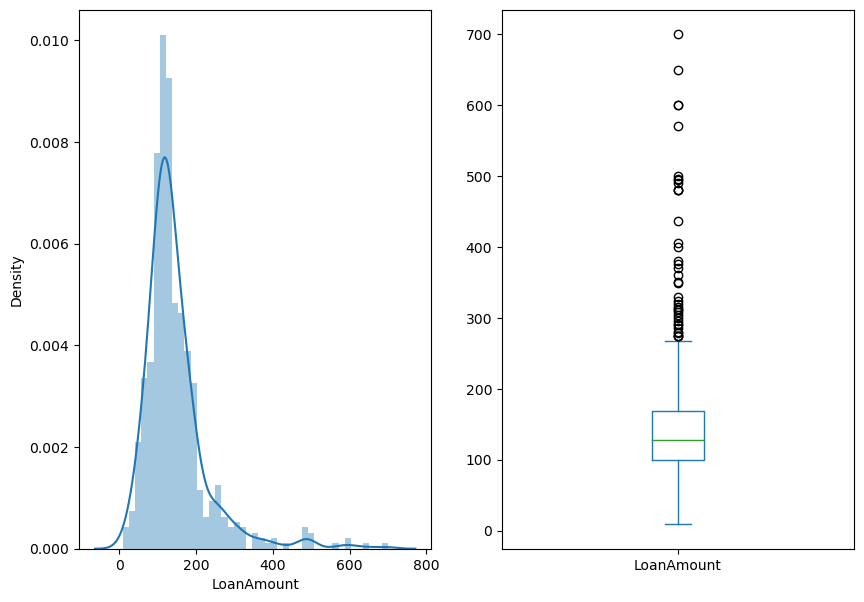
  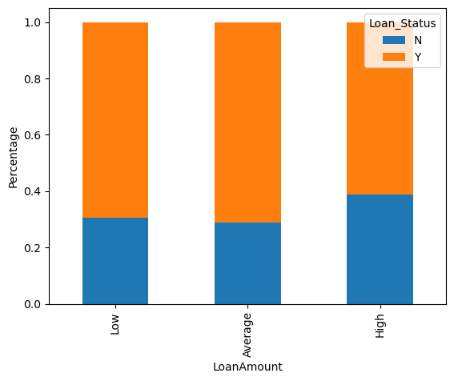

**Property_Area**
- The Property_Area column is a ordinal kind of qualitative data.
- All the applicants given their Property_Area.
- The ordinal datas present in this column are `Urban`, `Semiurban` and `Rural`.
- Most of the applicants are from semi-urban areas.
- The proportion of loans getting approved in semi-urban areas is higher as compared to that in rural or urban areas.

  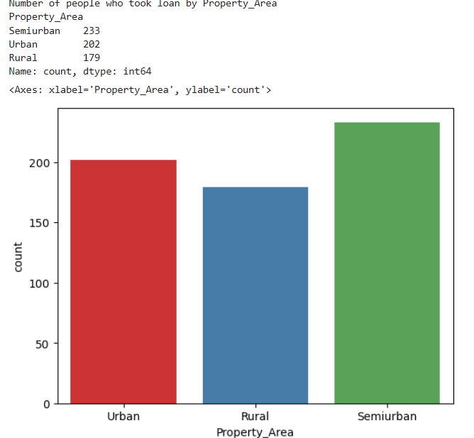
  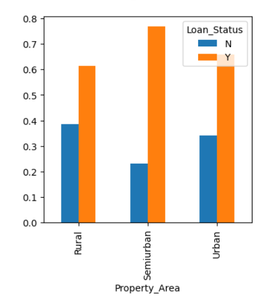

### Feature Creation.
 
 Based on the domain knowledge, we can come up with new features that might affect the target variable. We have created the following three new features:

- **Total Income:-** As discussed during bivariate analysis we will combine the Applicant Income and Co-applicant Income. If the total income is high, the chances of loan approval might also be high.
- **EMI:-** EMI is the monthly amount to be paid by the applicant to repay the loan. The idea behind making this variable is that people who have high EMI’s might find it difficult to pay back the loan. We can calculate the EMI by taking the ratio of loan amount with respect to loan amount term.
- **Balance Income:-** This is the income left after the EMI has been paid. The idea behind creating this variable is that if this value is high, the chances are high that a person will repay the loan and hence increasing the chances of loan approval.

### Test data prediction

  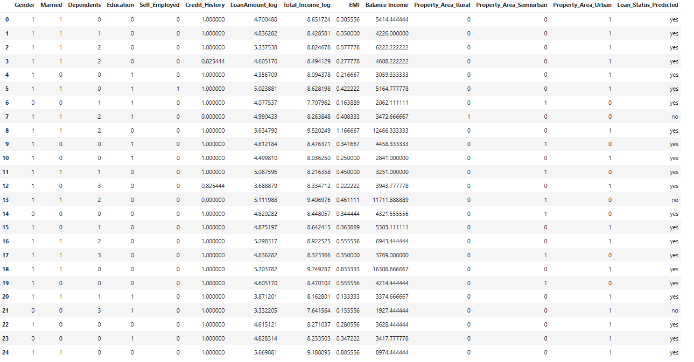

## Conclusion
We have build a Random Forest classifier that performs well with the selected features such as Gender,Married,Dependents,Education,Self_Employed, Credit_History,Property_Area,LoanAmount_log,Total_Income_log,Emi,Balance Income. Giving **89% accuracy**.

